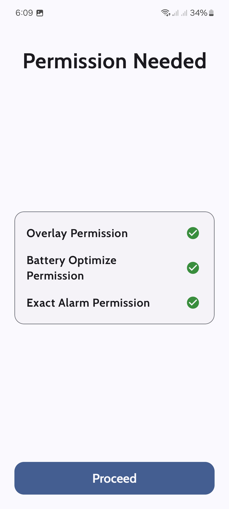
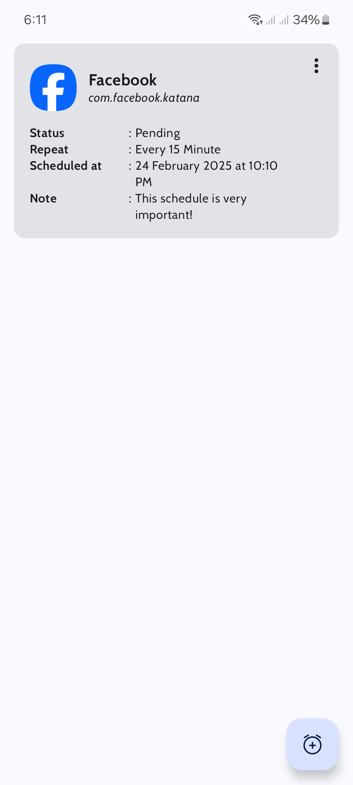
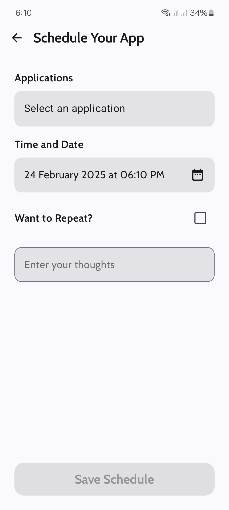

<table>
  <tr>
    <td align="center">
       
    </td>
    <td> <h1>ScheduleIt</h1> ScheduleIt is an Android application that allows users to schedule any installed app to open at a specific time. It works even when the device is in power-saving mode or locked. Users can also set intervals (minutes/hours/months) for repeated app launches.   
</td>
  </tr>
</table>

## ✨ Features
📅 <b>Schedule Any App</b> – Open any installed application at a scheduled time.  
🔄 <b>Repeat Intervals</b> – Set intervals (minutes, hours, months) for continuous app launches.  
🔒 <b>Works in Background</b> – Functions even in power-saving mode or when the device is locked.  
🎨 <b>Modern UI</b> – Built with Jetpack Compose following Material Design guidelines.  
📂 <b>Data Persistence</b> – Uses Room Database to store schedules efficiently.  

## 🛠 Tech Stack
- <b>Programming Language :</b> Kotlin
- <b>UI Framework :</b> Jetpack Compose
- <b>Database :</b> Room Database
- <b>Design :</b> Material Design 3
- <b>IDE :</b> Android Studio

## Screenshots
  

## Author

- [Rakib Hasan](https://www.github.com/rakibhasan1030)

## Feedback

If you have any feedback, please reach out to me at rakibhasan1030@gmail.com
